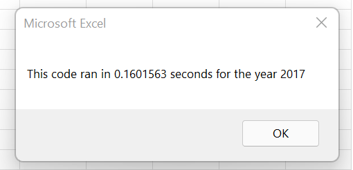
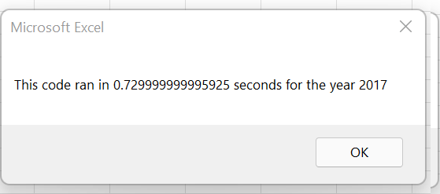
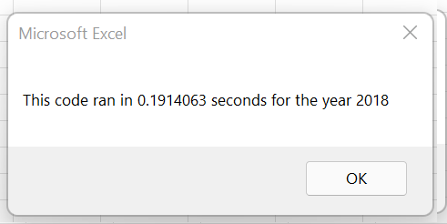
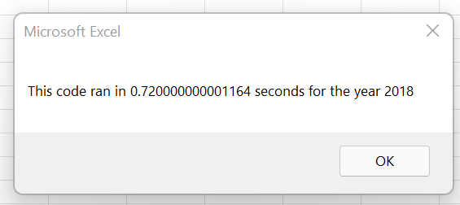

# Refactor VBA Code and Measure Performance

## Overview of Project
### Purpose of Project
In this challenge, I refactored code to loop through all the data one time in order to collect the same information from the original code. Then I determined how I was able to refactor the code successfully to make the VBA script run faster. 

**Refactor**: editing exisiting code to make it more efficient—by taking fewer steps, using less memory, or improving the logic of the code to make it easier for future users to read

### Background of Project
The original code compares stock market stocks. It currently works well for a dozen stocks so I refractored code is used to expand the dataset to include the entire stock market over the last few years and improved the code so that it runs faster than the original code. 

---
## Results
Results: Using images and examples of your code, compare the stock performance between 2017 and 2018, as well as the execution times of the original script and the refactored script.

AllStocksAnalysis()
AllStocksAnalysisRefactored()
The analysis is well described with screenshots and code (4 pt).

 

 

Based on the line graph above, I had the following takeways about theather campaigns:
* May, June, and July respectively had the highest number of successful campaigns. 
* October and May respectively had the highest number of failed campaigns.
* December had about as many successful campaigns as failed ones.
* In every month there were more successful than failed campagins. Generally, the successful and failed trend lines create the same shape and are similar to each other with the exception of May, October, and December. In May, the larger than average gap between successful and failed campaigns suggests a better chance for success. In October, the smaller than average gap between successful and failed campaigns suggests a better chance for failure. 

Next, I organized the data to see if the funding goal could impact the kickstarter's success. First, I needed to count the number of successful, failed, and canceled plays by goal. To do this, I used the COUNTIFS formula. For example, to count the number of successful plays with a goal between 1,000 and 4,999 I wrote the formula =COUNTIFS('Raw Data'!$O:$O, "plays",'Raw Data'!$D:$D, ">=1000", 'Raw Data'!$D:$D, "<5000", 'Raw Data'!$F:$F, "successful"). Then, I converted the number of successful, failed, and cancled plays to a percentage to more accurately compare them. Using this information, I created the line graph shown below. 

Based on the line graph above, I had the following takeways about play campaigns:
* Because there are zero cancled plays, successful and failed campaigns are symetric about the 50% line. 
* Generally, the percentage of successfully funded plays decreases as the goal increases with the exception of 29,999 to 49,999. This exception is likely due to a smaller sample size of 11 or less. 
* Plays with a goal of less than 5,000 have a success rate 20 points higher than plays with a goal between 5,000 and 20,000. 

There are three key difference between the original and refractored code. 
1. The refractored code contains three output arrays.
      -Dim tickerVolumes(12) As Long
      -Dim tickerStartingPrices(12) As Single
      -Dim tickerEndingPrices(12) As Single
2. The original code contain a nested loop while the refracted code contains three loops. 
    -Original: Loop to initialize the tickerVolumes to zero and nested loop to increase volume over all the rows in the spreadsheet.
    -Refracted: First loop to initializes the tickerVolumes to zero. Second loop to increase volume over all the rows in the spreadsheet. Third loop to format the spreadsheet.  
4. The refracted code contains a formatting loop while the original code runs that as a seperate code.     

    
    Next i

        

## Summary 
